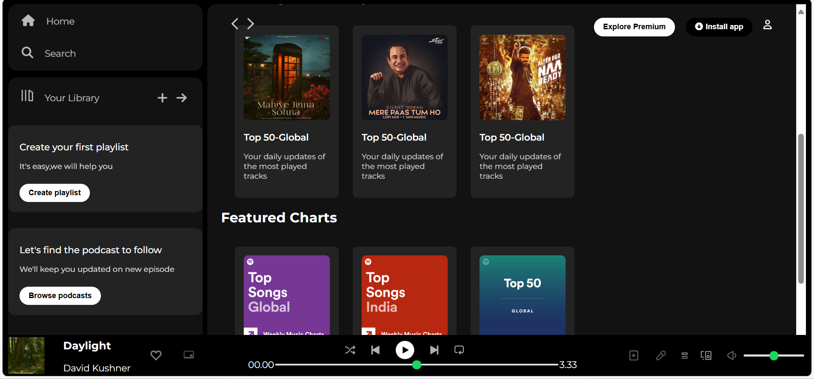

# 🎵 Spotify Clone (HTML & CSS)

A simple frontend clone of the Spotify web player built using pure **HTML** and **CSS**.  
Designed to replicate Spotify’s layout, colors, and responsiveness without using any JavaScript.

---

## ✨ Features

- 🎨 Pixel-perfect Spotify-inspired UI
- 📱 Responsive design for desktop and mobile
- 🎵 Styled playlists, sidebar, and music player bar
- 🖌️ Custom colors, gradients, and fonts similar to Spotify

---

## 🛠️ Technologies Used

- **HTML5** – Structure and layout
- **CSS3** – Styling, animations, and responsiveness

---

## 📸 Screenshots

_Add screenshots of your project here:_



---

## 🚀 Getting Started

### 📋 Prerequisites
- Any modern web browser

### ▶️ Run Locally
1. Clone this repository:
```bash
git clone https://github.com/yourusername/spotify-clone-html-css.git
